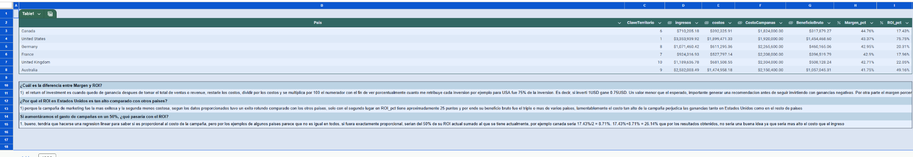
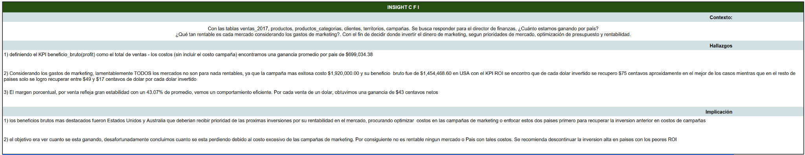

## 📂 Project Files

**Main project workbook**

➡️ https://github.com/titankrak-hash/financial-performance-analysis-sql/raw/refs/heads/main/Proyecto%203_%20An%C3%A1lisis%20del%20desempe%C3%B1o%20financiero%20con%20SQL%20-%20Resumen%20ejecutivo%20%20(1).xlsx

# Adventure Works Financial Analysis (SQL)

Financial performance analysis using SQL to evaluate revenue, profitability, and marketing ROI across different countries.

## Project Overview

This project was completed during the TripleTen Data Analytics Bootcamp.

The objective was to analyze Adventure Works sales data and answer two key business questions:

- Which countries generate the highest revenue?
- Which markets are the most profitable after marketing costs?

## Tools

- SQL
- PostgreSQL
- Google Sheets

## Skills Demonstrated

- SQL JOINs
- Data Cleaning
- Financial KPIs
- Revenue Analysis
- Gross Profit Calculation
- Margin %
- ROI Analysis
- Business Insights

## Business KPIs

- Revenue
- Total Cost
- Gross Profit
- Gross Margin %
- Marketing ROI %

## Project Workflow

1. Explored the database schema.
2. Joined sales, products, territories and marketing tables.
3. Cleaned missing values using COALESCE.
4. Calculated financial KPIs.
5. Performed QA validation.
6. Produced executive business recommendations.

## Dashboard

### Financial Results

### Executive Summary

## Key Findings

- United States generated the highest gross profit.
- Australia was the second strongest market.
- Gross margins remained stable across countries.
- Marketing investment significantly reduced overall profitability, suggesting budget optimization opportunities.
